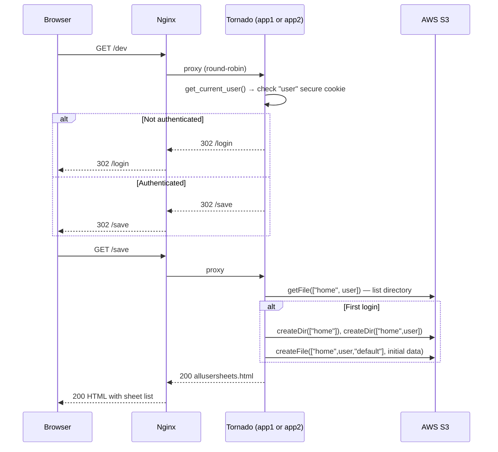
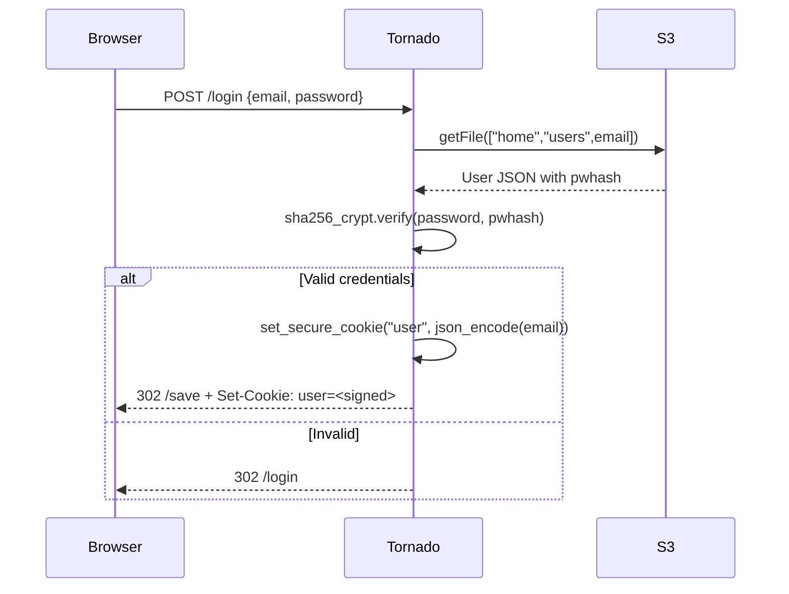
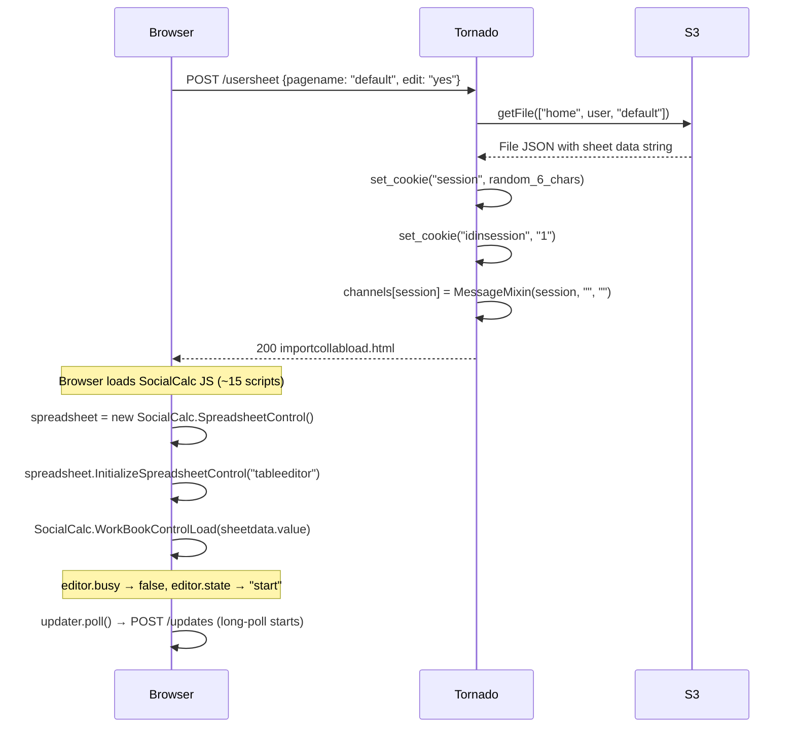
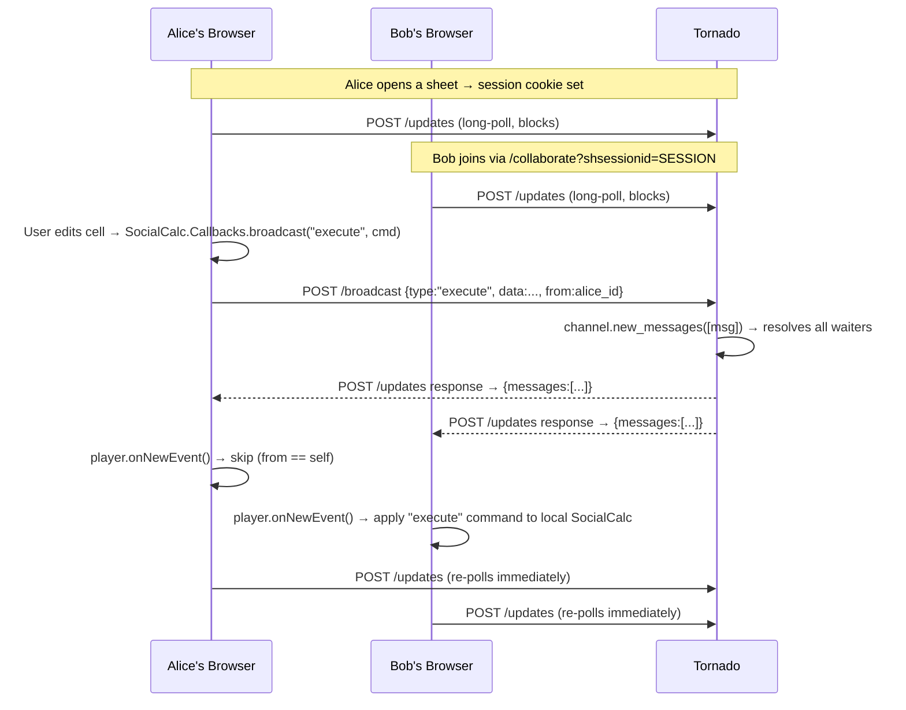

# MC2 — Aspiring Investments Cloud Spreadsheet App

MC2 is a browser-based collaborative spreadsheet application built on Python 3 and Tornado 6. Users register, log in, create spreadsheets backed by AWS S3, edit them in a rich in-browser SocialCalc engine, save, reload, share, and collaborate in real-time via long-polling. The deployment model is two Tornado instances behind Nginx with shared Memcached session storage, all orchestrated by Docker Compose.

---

## Table of Contents

1. [Project Overview](#1-project-overview)
2. [Architecture Diagram](#2-architecture-diagram)
3. [Technology Stack](#3-technology-stack)
4. [Repository Structure](#4-repository-structure)
5. [Codebase Overview](#5-codebase-overview)
6. [Application Flow](#6-application-flow)
7. [Authentication Flow](#7-authentication-flow)
8. [Spreadsheet Flow](#8-spreadsheet-flow)
9. [Storage Layer](#9-storage-layer)
10. [Long-Polling and Collaboration](#10-long-polling-and-collaboration)
11. [Python 3 Migration](#11-python-3-migration)
12. [Docker](#12-docker)
13. [Nginx](#13-nginx)
14. [Memcached](#14-memcached)
15. [Playwright Test Suite](#15-playwright-test-suite)
16. [GitHub Actions CI](#16-github-actions-ci)
17. [Developer Guide](#17-developer-guide)
18. [Verification Guide](#18-verification-guide)
19. [Troubleshooting](#19-troubleshooting)
20. [EC2 Deployment Guide](#20-ec2-deployment-guide)

---

## 1. Project Overview

MC2 is an S3-backed spreadsheet application. The browser-side editor is [SocialCalc](https://github.com/nicowillis/SocialCalc), a JavaScript spreadsheet engine embedded directly in the page. The server side is Python/Tornado serving as:

- An authentication gateway (registration, login, logout, password reset via Amazon SES)
- A virtual filesystem façade over AWS S3 (create / read / update / delete spreadsheet files)
- A real-time collaboration relay (long-polling via `/broadcast` and `/updates`)
- A static-file server for the SocialCalc JavaScript engine and CSS

There are two entry-point files:

| File | Storage backend | Collaboration | Memcached | Docker target |
|------|----------------|---------------|-----------|---------------|
| `cloudmain-dev.py` | AWS S3 | Yes (`/broadcast`, `/updates`, `/sync`) | Yes | **This one** |
| `cloudmain.py` | AWS S3 (no memcache, no sync) | Routes commented out | No | Not used in Compose |
| `main.py` | MySQL via `torndb`/`pymysql` | Yes | No | Not used in Compose |

The Docker Compose stack runs only `cloudmain-dev.py`.

---

## 2. Architecture Diagram

```
┌─────────────────────────────────────────────────────────────────────┐
│                    Docker bridge network                            │
│                    (tornado_version_app_network)                    │
│                                                                     │
│  ┌────────────────────────────────────────────────────────────┐    │
│  │  nginx:1.27-alpine          configs/nginx.docker.conf      │    │
│  │  - round-robin upstream                                    │    │
│  │  - WebSocket upgrade map                                   │    │
│  │  - proxy headers                                           │    │
│  └────────────┬───────────────────────┬────────────────────────┘   │
│               │                       │                             │
│    ┌──────────▼──────────┐  ┌─────────▼───────────┐               │
│    │  app1               │  │  app2               │               │
│    │  cloudmain-dev.py   │  │  cloudmain-dev.py   │               │
│    │  python:3.14-slim   │  │  python:3.14-slim   │               │
│    │  port 8888 (internal│  │  port 8888 (internal│               │
│    └──────────┬──────────┘  └─────────┬───────────┘               │
│               │                       │                             │
│               └──────────┬────────────┘                            │
│                          │                                          │
│               ┌──────────▼──────────┐                              │
│               │  memcache           │                              │
│               │  memcached:1.6-alpine│                             │
│               │  port 11211 (internal│                             │
│               └─────────────────────┘                              │
└─────────────────────────────────────────────────────────────────────┘
           │
     host port 8080
           │
      Web browser
```

**Request flow summary:**

```
Browser → localhost:8080 → nginx (round-robin) → app1 or app2 → S3 / Memcached
```

Only nginx binds a host port. The Tornado containers and Memcached are network-internal only.

---

## 3. Technology Stack

| Layer | Component | Version | Role |
|-------|-----------|---------|------|
| Runtime | Python | 3.14 | Application runtime |
| Web framework | Tornado | 6.5.2 | Async HTTP server, routing, templates, cookies |
| S3 client | boto3 | 1.43.39 | All S3 operations |
| S3 core | botocore | 1.43.39 | Underlies boto3 |
| Password hashing | passlib | 1.7.4 | `sha256_crypt` for user passwords |
| Session cache | python-memcached | 1.62 | Memcached client (Dropbox token store) |
| MySQL client | pymysql | 1.2.0 | Used only in `main.py` (MySQL backend) |
| Container runtime | Docker | 29+ | Image build and run |
| Orchestration | Docker Compose | v2 | Multi-container management |
| Reverse proxy | Nginx | 1.27-alpine | Load balancing, WebSocket proxy |
| Session store | Memcached | 1.6-alpine | Shared in-memory cache across instances |
| Test framework | Playwright | 1.49+ | End-to-end browser tests |
| Test language | TypeScript | 5.x | Playwright test language |
| CI | GitHub Actions | — | Build, start, test, report |

---

## 4. Repository Structure

```
tornado_version/
│
├── cloudmain-dev.py        # PRIMARY entry point — S3 backend, collaboration, memcached
├── cloudmain.py            # Alternative entry point — S3, no memcache, no sync
├── main.py                 # Alternative entry point — MySQL backend (torndb)
├── sync.py                 # SyncHandler: per-user key/value store over S3
├── amazonwebapp.py         # AmazonWebApp standalone entry (legacy)
│
├── cloud/                  # Core backend modules (used by cloudmain-dev.py)
│   ├── authenticate/
│   │   ├── user.py         # User model, password hash, S3-backed user store
│   │   └── authenticate.py # Thin wrapper (delegates to user.py)
│   └── storage/
│       └── storage.py      # Virtual filesystem over S3 (dirs, files, CRUD)
│
├── amazon_cloud/           # Legacy copy of cloud/ using old boto (not used in Docker)
│
├── templates/              # Tornado Jinja2-style HTML templates
│   ├── base.html           # Site chrome: title, CSS link, user/logout bar
│   ├── userlogin.html      # Login form (POST /login)
│   ├── userregister.html   # Registration form (POST /register)
│   ├── userregister-ok.html     # Post-registration success page
│   ├── userregister-exists.html # Duplicate email error page
│   ├── allusersheets.html  # Dashboard: table of user's spreadsheet files
│   ├── importcollabload.html    # Full spreadsheet workspace (SocialCalc)
│   ├── lostpassword.html   # Forgot password form
│   ├── pwreset.html        # Password reset form (requires valid dongle)
│   └── (others)            # Import, run-as-webapp, stock templates
│
├── static/                 # Browser-side assets served by Tornado
│   ├── socialcalc-3.js          # SocialCalc core spreadsheet engine
│   ├── socialcalcspreadsheetcontrol.js  # Tabbed UI control (Save, Import tabs)
│   ├── socialcalctableeditor.js # Cell-level editor
│   ├── socialcalcworkbook.js    # Multi-sheet workbook
│   ├── autosave.js         # 10-second autosave timer, posts to /save
│   ├── updater.js          # Long-poll client: /broadcast → /updates loop
│   ├── screen.css          # Main stylesheet
│   ├── jquery.min.js       # jQuery (required by updater.js, autosave.js)
│   └── (others)            # Highcharts, Flot, fonts, images
│
├── util/
│   ├── amazon_ses.py       # Custom HMAC-SHA256 SES email client
│   └── (others)            # Stock data fetchers (not used in Docker target)
│
├── excelinterop/phpexcel/socialcalc/
│   ├── import.php          # PHP: Excel/ODS/CSV → SocialCalc format
│   └── export.php          # PHP: SocialCalc format → Excel/ODS/CSV
│
├── configs/
│   ├── nginx.docker.conf   # Nginx config for Docker Compose (the active one)
│   └── nginx.conf          # Legacy EC2 config (pagespeed, WordPress) — not used
│
├── Dockerfile              # python:3.14-slim, installs requirements, runs cloudmain-dev.py
├── docker-compose.yml      # 4-service stack: app1, app2, nginx, memcache
├── .dockerignore           # Excludes .git, tests, node_modules, credentials, .env
├── .env.example            # Environment variable template
│
├── tests/e2e/              # Playwright test suite
│   ├── auth.spec.ts        # Authentication tests (7)
│   ├── spreadsheet.spec.ts # Spreadsheet lifecycle tests (5)
│   ├── landing.spec.ts     # Routing and navigation tests (5)
│   ├── static-assets.spec.ts # CSS/JS/image serving tests (12)
│   ├── error-cases.spec.ts # 404, redirects, edge cases (8)
│   ├── load-balancing.spec.ts # Round-robin distribution tests (2)
│   ├── session.spec.ts     # Cross-instance session persistence tests (4)
│   ├── nginx.spec.ts       # Proxy headers, upgrade paths (7)
│   ├── docker.spec.ts      # Container health, DNS, memcached (7)
│   ├── helpers/app-helper.ts  # Shared page-interaction helpers
│   └── fixtures/auth.fixture.ts  # Authenticated page fixture
│
├── playwright.config.ts    # Playwright configuration (baseURL, workers, reporters)
├── package.json            # Node.js dev dependencies (@playwright/test, typescript)
└── .github/workflows/e2e.yml  # GitHub Actions CI workflow
```

---

## 5. Codebase Overview

### `cloudmain-dev.py` — Primary application (2144 lines)

The application class instantiation wires up all URL routes, reads AWS credentials (file first, then env vars), initialises the SES email client, and connects Memcached:

```python
memcache_host = os.environ.get('MEMCACHE_HOST', '127.0.0.1')
self.mc = memcache.Client([memcache_host], debug=0)
```

**Complete route table:**

| Route | Handler | Methods | Description |
|-------|---------|---------|-------------|
| `/dev` | `HomeHandler` | GET | Redirects to `/save` if logged in, else `/login` |
| `/login` | `UserLoginHandler` | GET, POST | Login form and authentication |
| `/logout` | `UserLogoutHandler` | GET | Clears `user` cookie, redirects to `/login` |
| `/register` | `UserRegisterHandler` | GET, POST | Registration form and user creation |
| `/lostpw` | `UserLostPasswordHandler` | GET, POST | Password reset email via SES |
| `/pwreset` | `PwResetHandler` | GET, POST | Password reset form (requires dongle) |
| `/save` | `SaveHandler` | GET, POST | Dashboard (list sheets) / save sheet data |
| `/usersheet` | `UserSheetHandler` | POST | Open sheet for editing; also handles delete |
| `/webapp` | `WebAppHandler` | GET, POST | API for webapp-mode actions (login check, inapp) |
| `/runas` | `RunAsHandler` | GET | Render spreadsheet as read-only webapp |
| `/runasemailer` | `RunAsEmailHandler` | POST | Email spreadsheet content via SES |
| `/import` | `ImportHandler` | GET, POST | Import spreadsheet (PHP/Excel interop) |
| `/downloadfile` | `DownloadFileHandler` | POST | Export sheet to Excel/ODS/PDF via PHP/wkhtmltopdf |
| `/htmltopdf` | `HtmlToPdfHandler` | GET, POST | HTML-to-PDF via wkhtmltopdf |
| `/iconimg` | `IconImgHandler` | GET, POST | Icon image generation |
| `/dropbox` | `DropBoxHandler` | GET, POST | Dropbox OAuth flow (disabled — returns 501) |
| `/inapp` | `InAppHandler` | POST | In-app purchase tracking (requires DB) |
| `/restore` | `RestoreInAppHandler` | GET, POST | Restore in-app purchases |
| `/sync` | `sync.SyncHandler` | GET, POST | Key/value sync store per user |
| `/broadcast` | `MessageNewHandler` | POST | Receive and relay collaboration message |
| `/updates` | `MessageUpdateHandler` | POST | Long-poll: wait for next collaboration message |
| `/collaborate(.*)` | `CollaborateHandler` | GET, POST | Join shared session / invite collaborator |
| `/finrecord` | `FinanceRecordKeeper` | GET, POST | Finance transaction S3 store |
| `/bisrecord` | `BusinessRecordKeeper` | GET, POST | Business record store (stub) |
| `/amazonwebapp/...` | `AmazonWebAppHandler` | — | Amazon webapp handler |

### `cloud/authenticate/user.py` — User model

All user data is stored as JSON files in S3 at the path `["home", "users", "<email>"]`. Each file contains:

```json
{
  "email": "user@example.com",
  "pwhash": "$5$rounds=...",
  "confirmed": true,
  "dongle": "",
  "lastlogin": "",
  "createdon": ""
}
```

Password hashing uses `passlib.hash.sha256_crypt`. The `.encrypt()` method is deprecated in passlib 1.7 (`.hash()` is preferred) but still functions correctly — it produces and verifies valid SHA-256 crypt hashes.

### `cloud/storage/storage.py` — Virtual filesystem

S3 is key-value storage. This module implements a directory tree on top of it:

- **Keys** are JSON-serialised Python lists: `'["home", "user@example.com", "mysheet"]'`
- **Directories** store a JSON object: `{"type": "dir", "data": "[\"default\", \"mysheet\"]", "path": [...]}`
- **Files** store a JSON object: `{"type": "file", "data": "<sheet content>", "path": [...]}`

The bucket name is **hardcoded** to `"mc2-app-storage-useast1"` in `storage.py`. The `AWS_S3_BUCKET` environment variable in `.env.example` is not read by the application.

### `sync.py` — Sync handler (80 lines)

`SyncHandler` implements a minimal per-user per-app key/value store over S3 at the path `["home", user, "securestore", "sync", appname, "entries"]`. Used by client-side code for data synchronisation.

### `static/updater.js` — Long-poll client

Implements the browser side of real-time collaboration:

1. On page load: `updater.poll()` issues `POST /updates`
2. Server holds the request until a message arrives (long-poll)
3. When `/broadcast` receives a message, all waiting `/updates` futures resolve
4. Client receives messages, dispatches via `player.onNewEvent()`
5. Immediately re-issues `POST /updates` to keep the connection alive

Also defines `$.postJSON(url, args, callback)` — a jQuery plugin that sends `application/x-www-form-urlencoded` POST requests and parses the JSON response with `eval()`.

### `static/autosave.js` — Autosave timer

Hooks into `SocialCalc.Callbacks.editAutoSave`. After any cell edit, schedules a 10-second timer. On expiry, posts `{fname, data}` to `POST /save` via `$.postJSON`.

---

## 6. Application Flow

### Full request lifecycle



### Unauthenticated redirect chain

`/save` → 302 `/dev` → 302 `/login` (both HomeHandler and SaveHandler redirect unauthenticated users to `/dev` first, then `/dev` itself redirects to `/login`)

---

## 7. Authentication Flow

### How authentication works



### Cookie mechanics

- **Cookie name:** `user`
- **Value:** Tornado `set_secure_cookie` — HMAC-signed, base64-encoded JSON containing the user's email
- **Signing key:** `COOKIE_SECRET` environment variable (falls back to the string `"fallback-local-dev-secret"` if unset — **never deploy without setting this**)
- **Reading:** `get_current_user()` in `BaseHandler` calls `get_secure_cookie("user")`, which verifies the HMAC signature before decoding

### Session vs Memcached

> **Important distinction:** The main `user` session cookie is **not** stored in Memcached. It is a self-contained signed cookie. Any Tornado instance can verify it using `COOKIE_SECRET`.

Memcached is used for **two specific flows only:**

1. **Dropbox OAuth tokens** — after completing the OAuth flow, `dropbox_auth_finish()` stores `{dbtoken, userid}` in Memcached keyed by the session ID, retrieved on subsequent Dropbox API calls.
2. **Collaborate session data** — `CollaborateHandler.post()` stores session info for shared spreadsheet invitations.

Because `COOKIE_SECRET` must be identical on both Tornado instances for cookies to be accepted by either, it is passed via environment variable in Docker Compose from the same `.env` file.

### Registration flow

```
POST /register {email, password, repassword}
  → cloud.authenticate.user.user_exists(email)
      → If exists: render userregister-exists.html
      → If new:
          create_user(email, password)
            → ensure ["home"] dir exists in S3
            → ensure ["home","users"] dir exists
            → createFile(["home","users",email], User JSON)
          set_current_user(email)  ← logs in immediately
          render userregister-ok.html
```

---

## 8. Spreadsheet Flow

### Opening a spreadsheet



### Saving a spreadsheet

The save form in `importcollabload.html` is submitted via JavaScript (not native form submit). `savecheck()` in the template calls:

```javascript
$.postJSON("/save", {fname: filename, data: SocialCalc.WorkBookControlSaveSheet()}, ...)
```

`SocialCalc.WorkBookControlSaveSheet()` serialises the entire workbook to a SocialCalc save format string.

```
POST /save {fname: "mysheet", data: "<SocialCalc save string>"}
  → SaveHandler.post()
      → getFile(["home", user, fname])
          → If null: createFile(path, data)
          → If exists: updateFile(path, data)
      → respond: {"data": "Done"}
  → Browser: alert("Done")
```

### Autosave

After any cell edit, `SocialCalc.Callbacks.editAutoSave` fires. A 10-second debounce timer starts. On expiry, if `editor.state === "start"` (user not actively typing), `Aspiring.AutoSave.TimerExpiry()` posts to `/save` with the current filename and sheet data.

### SocialCalc editor readiness

The SocialCalc editor initialises asynchronously via `setTimeout`. The reliable signal that the editor is ready to accept commands is:

```javascript
spreadsheet.editor.busy === false && spreadsheet.editor.state === 'start'
```

The DOM element `#sheetdata` (a hidden `<textarea>`) contains the raw SocialCalc save string loaded from the server. The tab IDs follow the pattern `SocialCalc-{name}tab` — the Save tab is `#SocialCalc-saveastab`.

---

## 9. Storage Layer

### S3 virtual filesystem

Every piece of application data is stored in the S3 bucket `mc2-app-storage-useast1` in us-east-1.

**S3 key structure:**

| S3 key (JSON-encoded path) | Content | Purpose |
|---------------------------|---------|---------|
| `["home"]` | Directory metadata | Root directory |
| `["home","users"]` | Directory metadata | User registry root |
| `["home","users","user@example.com"]` | User JSON | User account data |
| `["home","user@example.com"]` | Directory metadata | User home directory |
| `["home","user@example.com","default"]` | SocialCalc data | Spreadsheet file |
| `["home","user@example.com","securestore","inapp","appname"]` | JSON | In-app purchase counts |
| `["home","user@example.com","securestore","finrecord","key"]` | JSON | Finance records |
| `["home","user@example.com","securestore","sync","appname","entries"]` | JSON | Sync data |

**Directory object format (stored as S3 object body):**
```json
{
  "type": "dir",
  "path": ["home", "user@example.com"],
  "data": "[\"default\", \"mysheet\"]"
}
```

**File object format:**
```json
{
  "type": "file",
  "path": ["home", "user@example.com", "mysheet"],
  "data": "<SocialCalc save string or JSON>"
}
```

**Important:** The `AWS_S3_BUCKET` variable in `.env.example` is **not read** by `cloud/storage/storage.py`. The bucket name `"mc2-app-storage-useast1"` is hardcoded at line 28. To use a different bucket, modify that constant.

### S3 connection

```python
connection = boto3.resource(
    's3',
    aws_access_key_id=aws_access_key,
    aws_secret_access_key=aws_secret_key,
    endpoint_url='https://s3.amazonaws.com',
    config=Config(s3={'addressing_style': 'path'})
)
```

`S3_USE_SIGV4=True` is set both in the Dockerfile (`ENV`) and programmatically in `storage.py` (`os.environ['S3_USE_SIGV4'] = 'True'`). This is required for the `us-east-1` region with path-style addressing.

### MySQL backend (`main.py`)

`main.py` uses `torndb` (a MySQL convenience wrapper) with `pymysql` as the driver. It requires a running MySQL instance with the `aspiringinvestments` schema. This backend is **not deployed in Docker Compose** — it is only used in bare-metal/VM deployments.

The `main.py` file includes three compatibility shims applied at import time:
1. `connect_timeout=0` patch — torndb passes 0 which MySQLdb accepted but pymysql rejects
2. `MySQLdb.constants` mock — routes to `pymysql.constants`
3. `copy.copy` patch — satisfies torndb's converter dict inspection during import

---

## 10. Long-Polling and Collaboration

### Architecture

The collaboration system uses HTTP long-polling, not WebSockets. The protocol is implemented in `updater.js` (browser) and `MessageNewHandler`/`MessageUpdateHandler` (server).



### In-memory channel store

```python
channels = {}  # global dict: session_id → MessageMixin instance
```

**Critical limitation:** `channels` is a Python process-level global dictionary. Each Tornado container has its own independent `channels` dict. If user A is on app1 and user B is on app2, their long-poll connections are in different process spaces — they cannot communicate.

**Consequence:** Real-time collaboration only works if both collaborating users happen to be routed to the same container by nginx. With round-robin load balancing and no sticky sessions, collaboration is unreliable in the multi-instance Docker setup.

**Fix options:**
- Use Redis pub/sub as a shared message bus between containers
- Use sticky sessions in nginx (`ip_hash` upstream directive)
- Move collaboration to WebSockets with a shared broker

### `MessageMixin`

```python
class MessageMixin:
    def __init__(self, session, ticker, fname):
        self.waiters = []  # list of asyncio.Future objects
        self.cache = []    # message history (last 1000)

    async def wait_for_messages(self, cursor=None):
        # If messages exist after cursor, return immediately
        # Otherwise, create a Future and await it
        future = asyncio.get_running_loop().create_future()
        self.waiters.append(future)
        return await future

    def new_messages(self, message):
        # Resolve all waiting futures with the new message
        for future in self.waiters:
            if not future.done():
                future.set_result(message)
        self.waiters = []
```

This is proper `asyncio` usage — `wait_for_messages` suspends the Tornado coroutine without blocking the event loop.

---

## 11. Python 3 Migration

The migration from Python 2/Tornado 2 was performed in two stages (see git history):

1. **Commit `18a0a823`** — Automated syntax migration using `fissix` (Python 3 fork of `2to3`)
2. **Commit `423f3662`** — Manual fixes for runtime issues

### Changes made

| Area | Python 2 (legacy) | Python 3 / Tornado 6 |
|------|-------------------|----------------------|
| `urllib` | `import urllib`, `urllib2` | `import urllib.request, urllib.parse, urllib.error` |
| String | `basestring`, `unicode()` | `str` only |
| Dict iteration | `.iteritems()`, `.itervalues()` | `.items()`, `.values()` |
| `print` | `print "text"` | `print("text")` |
| `subprocess` | `commands.getoutput()` | `subprocess.getoutput()` |
| S3 client | `boto` (v2) with `S3Connection`, `Key` | `boto3` with `boto3.resource` |
| S3 addressing | Path-style via boto v2 | `Config(s3={'addressing_style': 'path'})` + `S3_USE_SIGV4=True` |
| S3 body encoding | String PUT directly | `body.encode('utf-8') if isinstance(body, str) else body` |
| Tornado async | `@tornado.gen.coroutine` + `yield` | `async def` + `await` |
| Tornado `IOLoop` | `IOLoop.instance()` | `IOLoop.instance()` (still valid in Tornado 6) |
| Long-poll futures | `tornado.concurrent.Future` | `asyncio.get_running_loop().create_future()` |
| Password hashing | N/A (uses passlib throughout) | `sha256_crypt.encrypt()` (deprecated → `.hash()` pending) |
| MySQL driver | `MySQLdb` | `pymysql` with compatibility shims in `main.py` |
| Legacy Tornado | `tornado/` directory (v2 source) | Renamed to `tornado_legacy/` to avoid shadowing pip-installed Tornado 6 |

### `tornado_legacy/` directory

The repository contains a `tornado_legacy/` directory (renamed from `tornado/` during migration). This is the original Tornado 2 source code kept for reference. It must **not** be on the Python path — the pip-installed Tornado 6 is what runs.

### Dropbox integration

`DropBoxHandler` uses `import dropbox` inside method bodies. The `dropbox` package is not in `requirements.txt`. Any call to the Dropbox endpoints returns HTTP 501 with the message: `"Dropbox integration is temporarily unavailable during the Python 3 migration."` This is intentional and safe.

### Known deprecation

`passlib.hash.sha256_crypt.encrypt()` is deprecated in passlib 1.7 (use `.hash()` instead). The application works correctly but produces a `DeprecationWarning` on each password creation or update. It will break when passlib 2.0 is released.

---

## 12. Docker

### Dockerfile

```dockerfile
FROM python:3.14-slim
WORKDIR /app
COPY requirements.txt .
RUN pip install --no-cache-dir -r requirements.txt
COPY . .
ENV S3_USE_SIGV4=True
EXPOSE 8888
CMD ["python", "cloudmain-dev.py", "--port=8888"]
```

**Build cache optimization:** `requirements.txt` is copied and installed before the application source. This means changing application code does not invalidate the pip install layer — only changes to `requirements.txt` do.

**`.dockerignore`** excludes:
- `.git`, `__pycache__`, `*.pyc` — version control and Python artifacts
- `.env`, `credentials`, `boto.cfg` — secrets (never baked into image)
- `node_modules/`, `tests/`, `playwright.config.ts` — test tooling not needed at runtime
- `docker-compose.yml`, `Dockerfile`, `.dockerignore` — Docker metadata

### Docker Compose services

```yaml
services:
  memcache:   # memcached:1.6-alpine — shared session/token store
  app1:       # built from Dockerfile — Tornado instance 1
  app2:       # built from Dockerfile — Tornado instance 2
  nginx:      # nginx:1.27-alpine — reverse proxy, only host-port binder
```

**Startup order:** `memcache` starts first (both app services `depends_on: memcache`). Nginx starts after both app instances (`depends_on: app1, app2`). Docker Compose `depends_on` only waits for container start, not application readiness.

**Network:** Single bridge network `tornado_version_app_network`. All containers resolve each other by service name (Docker embedded DNS). No hardcoded IPs anywhere.

**Environment variables:**

| Variable | Set in | Received by |
|----------|--------|-------------|
| `AWS_ACCESS_KEY_ID` | `.env` file | app1, app2 |
| `AWS_SECRET_ACCESS_KEY` | `.env` file | app1, app2 |
| `COOKIE_SECRET` | `.env` file | app1, app2 |
| `MEMCACHE_HOST` | Compose `environment:` | app1, app2 |
| `S3_USE_SIGV4` | Dockerfile `ENV` | app1, app2 (baked in) |

`MEMCACHE_HOST=memcache` overrides the default `127.0.0.1` so both containers connect to the shared Memcached service.

---

## 13. Nginx

Configuration file: `configs/nginx.docker.conf`

### Upstream configuration

```nginx
upstream tornado_app {
    server app1:8888;
    server app2:8888;
    keepalive 32;
}
```

No `weight` directive — default round-robin. `keepalive 32` keeps up to 32 idle connections to upstream servers open, avoiding TCP handshake overhead on every request.

### WebSocket upgrade map

```nginx
map $http_upgrade $connection_upgrade {
    default upgrade;
    ''      close;
}
```

This map sets `$connection_upgrade` to `"upgrade"` when the client sends an `Upgrade` header, or `"close"` for normal HTTP. Applied in location blocks for `/updates`, `/broadcast`, and `/collaborate`.

### Why these three routes get WebSocket treatment

| Route | Handler | Why |
|-------|---------|-----|
| `/updates` | `MessageUpdateHandler` | Long-poll — connections stay open for 300+ seconds |
| `/broadcast` | `MessageNewHandler` | Collaboration broadcast relay |
| `/collaborate` | `CollaborateHandler` | Collaboration session join/invite |

Even though the application uses HTTP long-polling (not WebSockets), nginx must not close these connections prematurely. The `proxy_read_timeout 86400s` (24 hours) and the Connection upgrade headers ensure the proxy does not interfere.

### Proxy headers

| Header | Value | Purpose |
|--------|-------|---------|
| `Host` | `$http_host` | Preserves the original Host header for `request.host` in Tornado |
| `X-Real-IP` | `$remote_addr` | Real client IP |
| `X-Forwarded-For` | `$proxy_add_x_forwarded_for` | Forwarded IP chain |
| `X-Forwarded-Proto` | `$scheme` | `http` or `https` |
| `X-Scheme` | `$scheme` | Legacy header for Tornado `X-Scheme` support |
| `Server` | (passed through) | `proxy_pass_header Server` — exposes `TornadoServer/6.5.2` to clients |

### Timeouts

| Directive | Value | Why |
|-----------|-------|-----|
| `proxy_connect_timeout` | 10s | Fail fast if a container is not responding |
| `proxy_send_timeout` | 300s | Allows large uploads |
| `proxy_read_timeout` | 300s (general), 86400s (long-poll routes) | Keeps long-poll connections alive |
| `client_max_body_size` | 50M | Allows large spreadsheet imports |

### `proxy_next_upstream error`

Only retries the request on a hard connection error (container down), not on a timeout. This prevents a slow request from being re-sent to another instance (which could cause duplicate writes to S3).

---

## 14. Memcached

### Why Memcached was introduced

When the application runs as a single process, in-memory state (Dropbox tokens, session info) is naturally shared. When two Tornado instances run behind a load balancer, each process has independent memory — a Dropbox token stored in app1's memory is not visible to app2.

Memcached provides a shared in-memory store that both app containers can read and write.

### What is stored in Memcached

| Key | Value | Set by | Read by |
|-----|-------|--------|---------|
| `<session_id>` | `{"dbtoken": "...", "userid": "..."}` | `DropBoxHandler.dropbox_auth_finish()` | `DropBoxHandler.get()` action `getToken` |

**What is NOT stored in Memcached:** The primary login session (`user` cookie). That is a self-contained HMAC-signed cookie verified using `COOKIE_SECRET`, which is identical on both containers.

### Configuration

```python
# cloudmain-dev.py, Application.__init__
memcache_host = os.environ.get('MEMCACHE_HOST', '127.0.0.1')
self.mc = memcache.Client([memcache_host], debug=0)
```

In Docker Compose, `MEMCACHE_HOST=memcache` resolves to the `memcache` container via Docker DNS.

In local development (outside Docker), `MEMCACHE_HOST` defaults to `127.0.0.1`, so a local Memcached daemon must be running on port 11211.

### What happens if Memcached is unavailable

- `python-memcached` does not raise exceptions on connection failure — it silently returns `None` for `.get()` and `False` for `.set()`
- Dropbox authentication will fail at the `getToken` step (returns `None` → `json.loads(None)` → `TypeError`)
- Main user authentication is unaffected (cookie-based, no Memcached dependency)
- Spreadsheet save/load is unaffected (S3-based)

---

## 15. Playwright Test Suite

### Overview

57 tests across 8 spec files. All tests run against the Docker Compose stack on `http://localhost:8080` (configurable via `BASE_URL`). Tests run sequentially (1 worker) to avoid shared-state conflicts between test users.

```
tests/e2e/
├── auth.spec.ts          (7 tests)  — registration, login, logout, edge cases
├── spreadsheet.spec.ts   (5 tests)  — open, edit cell, save, delete, default creation
├── landing.spec.ts       (5 tests)  — routing, redirects, 404
├── static-assets.spec.ts (12 tests) — CSS/JS/image serving, cache headers
├── error-cases.spec.ts   (8 tests)  — 404s, unauthorized redirects, POST endpoints
├── load-balancing.spec.ts (2 tests) — round-robin distribution via nginx log analysis
├── session.spec.ts       (4 tests)  — cookie presence, cross-instance persistence
├── nginx.spec.ts         (7 tests)  — proxy headers, WebSocket paths, nginx -t
└── docker.spec.ts        (7 tests)  — container health, DNS, memcached cross-instance
```

### Test architecture

**`playwright.config.ts`** — global configuration:
- `baseURL`: `process.env.BASE_URL || 'http://localhost:8080'`
- `workers: 1` — sequential execution prevents one test's S3 state from interfering with another
- `fullyParallel: false` — tests within a file also run sequentially
- `retries: 1` in CI, `0` locally
- Reporter: `html` (stored to `playwright-report/`) + `list` (console output)

**`tests/e2e/fixtures/auth.fixture.ts`** — the `authenticatedPage` fixture:

```typescript
authenticatedPage: async ({ page, testUser }, use) => {
  await registerUser(page, testUser.email, testUser.password);
  await loginUser(page, testUser.email, testUser.password);
  await use(page);  // test runs here
}
```

Each test that uses `authenticatedPage` gets a fresh user registered and logged in. Users are isolated by timestamp+random suffix email addresses.

**`tests/e2e/helpers/app-helper.ts`** — shared interaction helpers:

| Helper | Description |
|--------|-------------|
| `generateUniqueUser()` | Returns `{email: testuser_<ts+rand>@example.com, password}` |
| `registerUser(page, email, pw)` | Fills and submits `/register`, asserts success |
| `loginUser(page, email, pw)` | Fills `/login`, asserts redirect to `/save` |
| `logoutUser(page)` | Clicks logout link or navigates to `/logout` |
| `openSpreadsheet(page, name)` | Navigates to `/save`, clicks Edit, waits for SocialCalc ready |
| `waitForSpreadsheetReady(page)` | Polls `editor.busy === false && editor.state === 'start'` |
| `editSpreadsheetCell(page, cell, value)` | Calls `EditorScheduleSheetCommands`, waits for `!busy` |
| `getSpreadsheetCellValue(page, cell)` | Reads `spreadsheet.sheet.cells[cell].datavalue` |
| `saveSpreadsheetAs(page, filename)` | Clicks Save tab, fills filename, calls `savecheck()`, handles alert |

### Key design decisions

**No `waitForTimeout()`:** Every wait is event-driven — either `waitForURL`, `waitForSelector`, `waitForFunction`, or `expect(...).toBeVisible()`. The SocialCalc spreadsheet initialises asynchronously (uses `setTimeout` internally), so tests wait for `editor.busy === false` rather than sleeping.

**`docker.spec.ts` uses `execSync`:** These tests spawn `docker exec` and `docker compose` commands synchronously. They do not use the Playwright browser — they are infrastructure validation tests that live in the Playwright suite for unified reporting.

**Load balancing test methodology:** `load-balancing.spec.ts` snapshots the nginx access log upstream counts before sending 20 requests, then compares counts after. The `upstream=` field in the nginx log format (`$upstream_addr`) identifies which container handled each request.

### Running the tests

**Prerequisites:**
```bash
# 1. Docker Compose stack must be running
docker compose up -d --build

# 2. Wait for the application to be healthy
curl -s http://localhost:8080/login

# 3. Node.js dependencies must be installed
npm install

# 4. Playwright browser must be installed
npx playwright install chromium
```

**Run all tests:**
```bash
BASE_URL=http://localhost:8080 npx playwright test
```

**Run a specific file:**
```bash
BASE_URL=http://localhost:8080 npx playwright test tests/e2e/auth.spec.ts
```

**Run with headed browser (visible):**
```bash
BASE_URL=http://localhost:8080 npx playwright test --headed
```

**Run with step-through debugger:**
```bash
BASE_URL=http://localhost:8080 npx playwright test --debug
```

**View HTML report after run:**
```bash
npx playwright show-report
```

**Interactive UI mode:**
```bash
BASE_URL=http://localhost:8080 npx playwright test --ui
```

### Expected output

```
Running 57 tests using 1 worker

  ✓  [chromium] › auth.spec.ts:5 › register, login, and logout (13.7s)
  ✓  [chromium] › auth.spec.ts:21 › reject invalid login credentials (800ms)
  ... (57 total)

  57 passed (3.3m)
```

### Adding new tests

1. Create `tests/e2e/your-feature.spec.ts`
2. Import helpers from `./helpers/app-helper`
3. For tests needing a logged-in user, import `test` from `./fixtures/auth.fixture` instead of `@playwright/test`
4. Run with `npx playwright test tests/e2e/your-feature.spec.ts` to verify in isolation

---

## 16. GitHub Actions CI

File: `.github/workflows/e2e.yml`

**Triggers:**
- Push to `py3-tornado6-upgrade` branch
- Pull request targeting `py3-tornado6-upgrade` or `main`

**Pipeline steps:**

```
Checkout → Docker Buildx setup → Build & start Docker Compose
→ Health check (curl /login every 2s, up to 60s)
→ Node.js 22 + npm ci
→ Playwright install (chromium + system deps)
→ Run tests (BASE_URL=http://localhost:8080)
→ Upload HTML report artifact (7-day retention)
→ On failure: dump docker compose logs
→ Always: docker compose down
```

**CI environment setup:**
```bash
cp .env.example .env
sed -i 's/generate_a_random_secret_here/ci-test-cookie-secret-not-real/g' .env
```

The CI uses a fixed non-secret `COOKIE_SECRET` — this is intentional. Tests do not require a cryptographically secure secret, only consistency between containers.

**Artifact:** The Playwright HTML report is uploaded as `playwright-report` and retained for 7 days. Download from the GitHub Actions run page to inspect test traces, screenshots, and videos on failure.

---

## 17. Developer Guide

### Local development (without Docker)

```bash
# 1. Clone and enter the repo
git clone <repo-url>
cd tornado_version
git checkout py3-tornado6-upgrade

# 2. Create a virtual environment
python3 -m venv venv
source venv/bin/activate

# 3. Install Python dependencies
pip install -r requirements.txt

# 4. Set environment variables
cp .env.example .env
# Edit .env: fill in AWS_ACCESS_KEY_ID, AWS_SECRET_ACCESS_KEY, COOKIE_SECRET

# 5. Start a local Memcached daemon (required for Dropbox flow)
memcached -d   # or: brew services start memcached

# 6. Run the application
python cloudmain-dev.py --port=8888
# App is available at http://localhost:8888/login
```

### Docker Compose (recommended)

```bash
# Build and start all 4 containers
docker compose up -d --build

# Verify health
docker compose ps
curl -s -o /dev/null -w "%{http_code}" http://localhost:8080/login  # → 200

# View logs (all services)
docker compose logs -f

# View logs (specific service)
docker compose logs -f app1
docker compose logs nginx | grep upstream

# Stop all containers
docker compose down

# Rebuild after code changes
docker compose up -d --build

# Rebuild from scratch (no cache)
docker compose down && docker compose build --no-cache && docker compose up -d
```

### Running tests

```bash
# Install test dependencies (once)
npm install
npx playwright install chromium

# Run full suite (Docker Compose must be running)
BASE_URL=http://localhost:8080 npx playwright test

# Run a single suite
BASE_URL=http://localhost:8080 npx playwright test tests/e2e/auth.spec.ts

# View the HTML report
npx playwright show-report
```

### Scaling up

To add a third Tornado instance:

1. Add `app3` to `docker-compose.yml` (copy the `app2` block, change name to `app3`)
2. Add `server app3:8888;` to the `upstream tornado_app` block in `configs/nginx.docker.conf`
3. Run `docker compose up -d --build`

---

## 18. Verification Guide

Use this checklist to confirm the deployment is working correctly.

### Infrastructure

```bash
# ✓ Docker Compose config is valid
docker compose config --quiet && echo "OK"

# ✓ All 4 containers running, none restarting
docker compose ps

# ✓ Nginx config is syntactically valid
docker exec tornado_version-nginx-1 nginx -t

# ✓ Docker DNS resolves all service names
docker exec tornado_version-nginx-1 getent hosts app1 app2 memcache

# ✓ Memcached reachable from both app containers
docker exec tornado_version-app1-1 python3 -c "
import memcache,os; mc=memcache.Client([os.environ['MEMCACHE_HOST']])
mc.set('probe','ok'); print(mc.get('probe'))
"
docker exec tornado_version-app2-1 python3 -c "
import memcache,os; mc=memcache.Client([os.environ['MEMCACHE_HOST']])
print(mc.get('probe'))
"
# Both should print: ok

# ✓ No Python errors in logs
docker compose logs app1 app2 | grep -c "Traceback"  # → 0
```

### Application routes

```bash
# ✓ Login page returns 200
curl -o /dev/null -w "%{http_code}" http://localhost:8080/login       # → 200

# ✓ Registration page returns 200
curl -o /dev/null -w "%{http_code}" http://localhost:8080/register    # → 200

# ✓ /dev redirects to /login
curl -o /dev/null -w "%{http_code}" http://localhost:8080/dev         # → 302

# ✓ Unknown route returns 404
curl -o /dev/null -w "%{http_code}" http://localhost:8080/xyz         # → 404

# ✓ Static files return 200
curl -o /dev/null -w "%{http_code}" http://localhost:8080/static/screen.css  # → 200

# ✓ Nginx passes TornadoServer header
curl -I http://localhost:8080/login | grep Server                     # → TornadoServer/6.5.2
```

### Load balancing

```bash
# Send 20 requests and check distribution
for i in $(seq 1 20); do curl -s -o /dev/null http://localhost:8080/login; done
docker compose logs nginx | grep "GET /login" | awk '{print $NF}' | sort | uniq -c
# Both upstreams should appear with roughly equal counts
```

### Playwright

```bash
# ✓ All 57 tests pass
BASE_URL=http://localhost:8080 npx playwright test

# ✓ Open HTML report (view traces on failure)
npx playwright show-report
```

### Manual browser verification

1. Open `http://localhost:8080/login`
2. Register a new account at `http://localhost:8080/register`
3. Log in — you should be redirected to `/save` showing a `default` spreadsheet
4. Click **Edit** on `default` — the SocialCalc editor loads
5. Type a value in cell A1
6. Wait 10 seconds — autosave fires (check `docker compose logs app1 app2 | grep "fname is"`)
7. Click the **Save** tab, type a new filename, click **SaveAs** — alert says "Done"
8. Navigate back to `/save` — new filename appears in the list
9. Click **Delete** on the new filename — it disappears from the list
10. Click **logout** — redirected to `/login`, cookie cleared

---

## 19. Troubleshooting

| Symptom | Likely cause | Diagnosis | Fix |
|---------|-------------|-----------|-----|
| `docker compose up` fails with "address already in use" | Port 8080 occupied | `ss -tlnp \| grep 8080` | Change `"8080:80"` to `"8081:80"` in `docker-compose.yml` |
| nginx container exits immediately | Config syntax error | `docker compose logs nginx` | `docker exec nginx nginx -t` to see error |
| App containers restart loop | Python import error at startup | `docker compose logs app1` | Check traceback — usually missing env var or S3 connection |
| S3 operations fail (403 Forbidden) | Wrong credentials or wrong region | `docker compose logs app1 \| grep ERROR` | Verify `AWS_ACCESS_KEY_ID` / `AWS_SECRET_ACCESS_KEY` in `.env` |
| S3 operations fail (NoSuchBucket) | Wrong bucket name | same | The bucket name is hardcoded as `"mc2-app-storage-useast1"` in `cloud/storage/storage.py:28` |
| Login always fails | `COOKIE_SECRET` mismatch between containers | Check `.env` is loaded | Ensure `COOKIE_SECRET` is set and identical for both app1 and app2 |
| Sessions work on first request, fail on second | Memcached not running | `docker compose ps memcache` | Relevant only for Dropbox token flow — main login is cookie-based |
| Playwright tests fail with timeout on spreadsheet tests | SocialCalc JS taking too long to load | Check browser console | S3 slow? Static assets not caching? |
| Playwright `docker.spec.ts` fails | Container names changed | `docker compose ps` to verify names | Container names are `tornado_version-app1-1` etc. — check project name |
| `nginx -t` warns about duplicate MIME type | `text/html` in gzip_types | Informational only | Fixed in `configs/nginx.docker.conf` — `text/html` removed from gzip_types |
| `passlib DeprecationWarning` in logs | passlib 1.7 deprecates `.encrypt()` | `docker compose logs app1 \| grep Deprecation` | Replace `sha256_crypt.encrypt()` with `sha256_crypt.hash()` in `cloud/authenticate/user.py` |
| 502 Bad Gateway | Tornado container not ready | `docker compose logs app1` | Container may still be starting — wait a few seconds |
| Collaboration not working | In-memory `channels` dict not shared | By design | See [Section 10](#10-long-polling-and-collaboration) — requires Redis for multi-instance |

---

## 20. EC2 Deployment Guide

### Prerequisites

- EC2 instance (Ubuntu 22.04 LTS recommended, t3.small or larger)
- Docker and Docker Compose installed
- Security group with inbound port 80 (or 8080) open
- AWS IAM credentials with S3 access to `mc2-app-storage-useast1`

### Step-by-step

```bash
# 1. Connect to EC2
ssh -i your-key.pem ubuntu@<EC2_PUBLIC_IP>

# 2. Install Docker
sudo apt-get update
sudo apt-get install -y ca-certificates curl
sudo install -m 0755 -d /etc/apt/keyrings
sudo curl -fsSL https://download.docker.com/linux/ubuntu/gpg -o /etc/apt/keyrings/docker.asc
echo "deb [arch=$(dpkg --print-architecture) signed-by=/etc/apt/keyrings/docker.asc] \
  https://download.docker.com/linux/ubuntu $(. /etc/os-release && echo "$VERSION_CODENAME") stable" | \
  sudo tee /etc/apt/sources.list.d/docker.list > /dev/null
sudo apt-get update
sudo apt-get install -y docker-ce docker-ce-cli containerd.io docker-compose-plugin
sudo usermod -aG docker ubuntu
newgrp docker

# 3. Clone the repository
git clone <your-repo-url>
cd tornado_version
git checkout py3-tornado6-upgrade

# 4. Configure environment
cp .env.example .env
nano .env
```

Fill `.env` with production values:

```bash
AWS_ACCESS_KEY_ID=<your-real-key>
AWS_SECRET_ACCESS_KEY=<your-real-secret>
AWS_S3_BUCKET=mc2-app-storage-useast1  # informational only — not read by app
COOKIE_SECRET=<64-char random string>  # MUST be set — use: openssl rand -hex 32
DROPBOX_APP_KEY=<if using Dropbox>
DROPBOX_APP_SECRET=<if using Dropbox>
```

```bash
# 5. Choose host port
# For port 80 (standard HTTP), change docker-compose.yml:
sed -i 's/"8080:80"/"80:80"/' docker-compose.yml
# Note: Docker daemon runs as root so binding port 80 works without setcap

# 6. Start the stack
docker compose up -d --build

# 7. Verify health
docker compose ps
curl http://localhost:80/login

# 8. Access from internet
# http://<EC2_PUBLIC_IP>/login
```

### What differs between local and production

| Setting | Local | Production |
|---------|-------|------------|
| `COOKIE_SECRET` | Any string | Strong random secret (`openssl rand -hex 32`) |
| Host port | `8080` | `80` (or behind ALB on `443`) |
| `AWS_ACCESS_KEY_ID` | Your dev key | IAM role with minimal S3 permissions |
| Logging | Console | Consider forwarding to CloudWatch |
| HTTPS | None | ALB + ACM certificate, or nginx + Certbot |
| Memcached | Docker container | Consider AWS ElastiCache for persistence |

### Operations

```bash
# View logs
docker compose logs -f --tail=100

# Restart a specific service without downtime
docker compose restart app1

# Deploy code update (rebuild and restart with no downtime)
git pull
docker compose up -d --build

# Roll back to previous image
docker compose down
git checkout <previous-commit>
docker compose up -d --build

# Stop everything
docker compose down

# Remove everything including volumes
docker compose down -v
```

### Generating a secure COOKIE_SECRET

```bash
openssl rand -hex 32
# Example: a3f8b2c1d4e5f6a7b8c9d0e1f2a3b4c5d6e7f8a9b0c1d2e3f4a5b6c7d8e9f0a1
```

Set this value in `.env` as `COOKIE_SECRET=<value>`. Both `app1` and `app2` containers must receive the same value for session cookies to be accepted by either instance.

---

## Appendix: Environment Variables Reference

| Variable | Required | Default | Notes |
|----------|----------|---------|-------|
| `AWS_ACCESS_KEY_ID` | Yes | — | IAM key for S3 and SES |
| `AWS_SECRET_ACCESS_KEY` | Yes | — | IAM secret |
| `COOKIE_SECRET` | **Yes in production** | `fallback-local-dev-secret` | HMAC key for session cookies |
| `MEMCACHE_HOST` | No | `127.0.0.1` | Set to `memcache` in Docker Compose |
| `S3_USE_SIGV4` | No | Set by Dockerfile | Enables SigV4 signing — required for us-east-1 |
| `DROPBOX_APP_KEY` | No | — | Only needed for Dropbox integration (currently 501) |
| `DROPBOX_APP_SECRET` | No | — | Only needed for Dropbox integration |
| `DROPBOX_ACCESS_TOKEN` | No | — | Only needed for Dropbox integration |
| `AWS_S3_BUCKET` | No | — | **Not read by the application.** Bucket is hardcoded in `cloud/storage/storage.py:28` |

---

## Appendix: All HTTP Routes

| Method | Route | Auth required | Description |
|--------|-------|---------------|-------------|
| GET | `/login` | No | Login page |
| POST | `/login` | No | Authenticate user |
| GET | `/logout` | No | Clear cookie, redirect to `/login` |
| GET | `/register` | No | Registration form |
| POST | `/register` | No | Create user account |
| GET | `/lostpw` | No | Forgot password form |
| POST | `/lostpw` | No | Send password reset email (requires SES) |
| GET | `/pwreset` | No | Password reset form (requires valid dongle) |
| POST | `/pwreset` | No | Set new password |
| GET | `/dev` | No | Redirect: → `/save` or → `/login` |
| GET | `/save` | Yes | Dashboard: list user's spreadsheets |
| POST | `/save` | Yes | Save spreadsheet data to S3 |
| POST | `/usersheet` | Yes | Open spreadsheet for editing; or delete |
| GET | `/import` | Yes | Import spreadsheet page |
| POST | `/import` | Yes | Process uploaded file (PHP interop) |
| POST | `/downloadfile` | No | Export sheet (PHP/wkhtmltopdf) |
| POST | `/broadcast` | No | Relay collaboration message |
| POST | `/updates` | No | Long-poll: receive collaboration messages |
| GET/POST | `/collaborate(.*)` | No | Join/invite collaboration session |
| GET/POST | `/sync` | Yes | Per-user/app key-value sync store |
| GET/POST | `/webapp` | Partial | JSON API for webapp-mode actions |
| GET | `/runas` | Yes | Render sheet as read-only webapp |
| POST | `/runasemailer` | Yes | Email sheet content via SES |
| GET/POST | `/dropbox` | No | Dropbox OAuth (returns 501) |
| GET/POST | `/finrecord` | Yes | Finance record CRUD over S3 |
| GET/POST | `/bisrecord` | No | Business record stub |
| GET/POST | `/inapp` | No | In-app purchase (requires MySQL — not active) |
| GET/POST | `/restore` | No | Restore in-app purchases |
| GET/POST | `/iconimg` | No | Icon image generation |
| GET/POST | `/htmltopdf` | No | HTML to PDF conversion |
| GET/POST | `/amazonwebapp/<p1>/randomCode/<p2>` | No | Amazon webapp handler |
