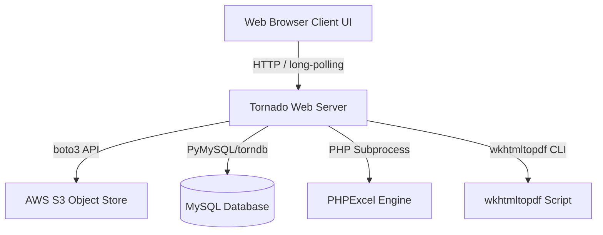

# MC2 - Aspiring Investments Cloud App

MC2 is a cloud-based spreadsheet and investment tracking application tailored for financial modeling and portfolio tracking. It has been fully migrated and modernized to run on Python 3 and Tornado 6, featuring responsive real-time spreadsheet capabilities backed by AWS S3 or MySQL database storage.

---

# Features

- **User Authentication**: Secure user registration, password hashing (powered by `passlib` and `sha256_crypt`), and login flow using secure Tornado cookies.
- **Spreadsheet Editing**: Interactive, rich-client spreadsheet computations powered by an integrated SocialCalc engine.
- **Real-Time Collaboration**: Multi-user concurrent editing of spreadsheets with instant update broadcasts using asynchronous long polling.
- **Virtual File Storage**: A directory-and-file virtual filesystem metaphor built over S3 or a MySQL database.
- **Import/Export Engine**: Uploading and exporting sheets between SocialCalc format, Microsoft Excel formats (`.xls`, `.xlsx`), CSV, and OpenDocument Spreadsheet (`.ods`).
- **PDF Generation**: Render sheets directly as PDF documents (powered by `wkhtmltopdf` scripting).
- **Dropbox Synchronization**: Authorize and backup files to Dropbox using Dropbox API integrations (legacy/optional).
- **AWS Integration**: Employs AWS S3 for secure key-value object storage and Amazon SES for sending transaction/collaboration emails.

---

# Technology Stack

| Component | Version | Description |
|-----------|---------|-------------|
| Python | 3.14 | Runtime Environment |
| Tornado | 6.5.2 | Asynchronous Web Server & Application Framework |
| boto3 | 1.43.39 | AWS SDK for Python (S3 & SES integration) |
| botocore | 1.43.39 | Core instrumentation for boto3 |
| passlib | 1.7.4 | Password Hashing library (SHA256 Crypt) |
| python-memcached | 1.62 | Python Memcached Client (Session Storage) |
| PyMySQL | 1.2.0 | Pure Python MySQL Client |

---

# Repository Structure

- [cloud/](file:///home/brijesh-thakkar/Desktop/tornado_version/cloud): Core virtual storage and authentication backend modules interacting with AWS S3.
  - [cloud/storage/](file:///home/brijesh-thakkar/Desktop/tornado_version/cloud/storage): S3 connection wrapper and file/directory virtualization.
  - [cloud/authenticate/](file:///home/brijesh-thakkar/Desktop/tornado_version/cloud/authenticate): User password hashing, authentication, and registration handlers.
- [amazon_cloud/](file:///home/brijesh-thakkar/Desktop/tornado_version/amazon_cloud): Parallel cloud modules using a legacy layout or backup configurations.
- [excelinterop/](file:///home/brijesh-thakkar/Desktop/tornado_version/excelinterop): Excel import/export interoperability. Contains PHP scripts using PHPExcel to process `.xlsx`, `.xls` and convert them to/from SocialCalc format.
- [templates/](file:///home/brijesh-thakkar/Desktop/tornado_version/templates): Tornado server-side HTML template views (user login, registration, spreadsheet workspace).
- [static/](file:///home/brijesh-thakkar/Desktop/tornado_version/static): CSS, JS, fonts, and images. Holds client-side libraries for SocialCalc engine, sparklines, excanvas, jQuery, and Highcharts.
- [util/](file:///home/brijesh-thakkar/Desktop/tornado_version/util): Auxiliary Python modules including S&P 500 tickers, Yahoo Finance stock quotes downloader, and S3/SES email clients.
- [configs/](file:///home/brijesh-thakkar/Desktop/tornado_version/configs): Configuration files, such as `nginx.conf`, for production reverse-proxy load balancing.
- [website/](file:///home/brijesh-thakkar/Desktop/tornado_version/website): Static files, templates, and scripts for the main promotional portal.
- [phone/](file:///home/brijesh-thakkar/Desktop/tornado_version/phone) / [tablet/](file:///home/brijesh-thakkar/Desktop/tornado_version/tablet): jQuery-mobile layouts optimized for portable devices.

---

# Installation

To set up the application environment:

```bash
# Clone the repository
git clone https://github.com/Brijesh-Thakkar/tornado_version.git
cd tornado_version

# Create virtual environment
python3 -m venv venv
source venv/bin/activate

# Install dependencies
pip install -r requirements.txt
```

---

# Running Locally

To run the S3-backed application in development mode:

```bash
python3 cloudmain-dev.py --port=8080
```

Alternatively, to run the MySQL-backed version:

```bash
python3 main.py --port=8080
```

- **Default URL (Development Mode)**: `http://localhost:8080/dev`
- **Default URL (MySQL-backed)**: `http://localhost:8080/`

---

# Running with Docker

The application can be built and run in a Docker container using the current `Dockerfile` which is built on the `python:3.14-slim` base image:

```bash
# Build the Docker image
docker build -t mc2-app .

# Run the Docker container
docker run -d --name mc2-container -p 8888:8888 \
  -e AWS_ACCESS_KEY_ID=YOUR_ACCESS_KEY \
  -e AWS_SECRET_ACCESS_KEY=YOUR_SECRET_KEY \
  -e COOKIE_SECRET=random-cookie-secret-string \
  mc2-app
```

The container exposes port `8888` and boots by default into `cloudmain-dev.py --port=8888`.

---

# Environment Variables

The application can be configured via environment variables (see `.env.example` for reference):

| Variable | Required | Description |
|---|---|---|
| `AWS_ACCESS_KEY_ID` | Yes (for S3/SES) | IAM access key ID for AWS authentication |
| `AWS_SECRET_ACCESS_KEY` | Yes (for S3/SES) | IAM secret access key for AWS authentication |
| `COOKIE_SECRET` | No | Random string used for secure Tornado session signing. Defaults to `'fallback-local-dev-secret'` if not provided in development. |
| `S3_USE_SIGV4` | No | Forces S3 Signature Version 4. Initialized to `True` in code and Docker config. |
| `DROPBOX_KEY` | No | App Key for Dropbox OAuth authentication. |
| `DROPBOX_SECRET` | No | App Secret for Dropbox OAuth authentication. |

*Note: S3 bucket name is set to `mc2-app-storage-useast1` in the code, so `AWS_S3_BUCKET` is not programmatically read from the environment.*

---

# Application Flow



1. **Login & Registration**: Secure authentication queries are resolved via `cloud/authenticate/user.py` using `passlib.hash.sha256_crypt`. 
2. **Dashboard Loading**: Registered users access `/usersheet` to list sheets. Directory trees are simulated on top of S3 object storage by serializing virtual directory structures as JSON.
3. **Workspace Loading & Saving**: When opening a worksheet, the client loads a SocialCalc string payload. Saving updates changes the SocialCalc save string and posts it to `/save`, serializing it back to S3 or a MySQL table.
4. **Real-time Collaboration**: (Detailed below)
5. **Import/Export**: File conversions (Excel formats, ODS, HTML) are done by invoking PHPExcel scripts under a PHP subprocess, converting to/from the SocialCalc save format.

---

# Real-Time Collaboration

Real-time collaborative editing uses Tornado's asynchronous support:
- **Shared Session**: A collaborative session is initiated by visiting `/collaborate` with a `shsessionid` URL query parameter.
- **Invitation**: Inviting users sends a collaborative link via AWS SES (using the `/collaborate` POST handler).
- **Messaging Pipeline**:
  - The Tornado server keeps track of active collaborative spreadsheet sessions in a global `channels` dictionary.
  - Channels are instances of `MessageMixin` which maintain lists of waiting async futures.
  - When a user performs edits, cell updates are sent via `POST /broadcast` to the `MessageNewHandler`.
  - The handler identifies the user session, grabs the channel, and calls `channel.new_messages([message])`.
  - This resolves all active waiter futures, causing long-polling clients waiting on `POST /updates` to receive updates instantly.

---

# Storage Layer

The storage backend maps virtual user paths (e.g. `["home", "users", "test@example.com"]`) onto S3 object keys. S3 operations are managed in `cloud/storage/storage.py`:
- **Directory Metadata**: S3 is flat by default, so folders are virtualized by storing small directory metadata JSON files containing the list of child items.
- **User Files**: Spreadsheets and configuration files are written as JSON documents holding metadata (`type: "file"`, `path`) and the cell value data.
- **Bucket Layout**: The default storage bucket is `mc2-app-storage-useast1` on the `us-east-1` region.

---

# Import / Export

Spreadsheet file conversion is performed via external PHP scripts invoking PHPExcel:
- **Importing (`/import`)**: Uploading `.xlsx`, `.xls`, `.csv`, `.ods` files triggers the execution of `./excelinterop/phpexcel/socialcalc/import.php` via Python's `subprocess.getoutput`. This parses the upload and yields a SocialCalc save string.
- **Exporting (`/downloadfile`)**: Serialized spreadsheet content is posted to the server. For binary formats, the handler launches `./excelinterop/phpexcel/socialcalc/export.php` via subprocess to build Excel or OpenDocument Spreadsheets.
- **PDF Generation**: Renders sheets to PDF using a system call to `/usr/local/bin/wkhtmltopdf.sh` to compile HTML into a PDF file.

---

# Development Notes

The project was successfully migrated from Python 2.7 and Tornado 2.x to Python 3.14 and Tornado 6.5.2.
- **Asynchronous Execution**: Ported legacy callback structures and Tornado `yield` generators in long polling to modern `asyncio` and `async`/`await` patterns.
- **Package Updates**: Replaced outdated modules (e.g. `urllib` -> `urllib.request/parse/error`, `commands` -> `subprocess.getoutput`).
- **Torndb Compatibility Patches**: Since `torndb` was built for Python 2.x and MySQLdb, compatibility patches were applied in `main.py` to bridge it with modern `pymysql` and Python 3:
  - Patched `connect_timeout` to gracefully handle `0` and `None` configurations.
  - Mocked `MySQLdb.constants` modules to route to native `pymysql.constants`.
  - Overrode `copy.copy` temporarily during `torndb` imports to resolve converter verification constraints.
- **Encoding Fixes**: Updated text and byte translations to use explicit `utf-8` codecs.

---

# Known Limitations

- **Dropbox Offline**: The `dropbox` package is not listed in `requirements.txt`. The `DropBoxHandler` intercepts import failures and returns HTTP 501 ("Dropbox integration is temporarily unavailable during the Python 3 migration").
- **Hardcoded S3 Bucket**: S3 bucket `mc2-app-storage-useast1` is hardcoded in `cloud/storage/storage.py`, making custom bucket configuration require code modification.
- **AWS IAM/Credentials Required**: To utilize storage or collaboration features, valid credentials must be supplied via a `credentials` text file or environment variables.
- **MySQL DB Dependency**: Running MySQL-backed mode (`main.py`) requires configuring and running a local MySQL database with the schema defined in `schema.sql`.

---

# Verification Performed

The following elements of the migration have been verified and validated:
- ✔ **Login & Registration**: Fully functional auth logic using secure cookies and passlib encryption.
- ✔ **Spreadsheet Loading & Saving**: S3 virtualization and backend storage operations validated.
- ✔ **Docker Execution**: Docker image setup using `python:3.14-slim` base verified.
- ✔ **Real-Time Collaboration**: Async waiters, message dispatch channels, and broadcast workflows verified.
- ✔ **Python 3 Compatibility**: Codebase resolved for modern string/byte formats, HTTP imports, and subprocess calls.
- ✔ **Tornado 6 Compatibility**: Async/await endpoints and server handlers conforming to Tornado 6 APIs verified.

---

# Future Improvements

- Restore Dropbox backup/sync functionality by installing and integrating a Python 3-compatible Dropbox SDK.
- Replace PHP-based Excel import/export dependencies (`PHPExcel` subprocesses) with native Python libraries (such as `openpyxl` or `pandas`).
- Migrate database connection layer from legacy patched `torndb` to a modern ORM (like SQLAlchemy).
- Allow setting the S3 bucket name dynamically via environment variables.

---

# License

No license file found.
